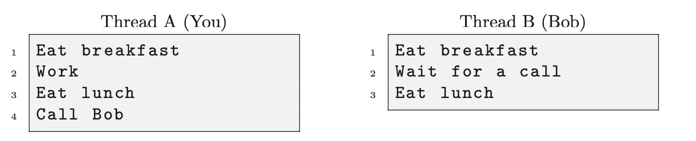
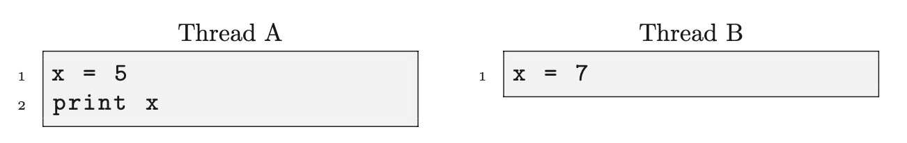
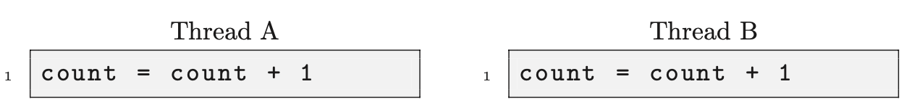
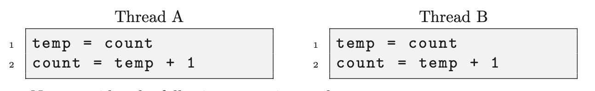

# Introduction

## Synchronization

In common use, *synchronization* means making two things happen at the same time.
In computer systems, *synchronization* refers to relationships among events - any number of events, and any kind of relationships (before, during, after).

Programmers are often concerned with **synchronization constraints**, which are requirements pertaining to the order of events.

Examples:

- **Serialization**: Event A must happen before Event B.
- **Mutual Exclusion** or **mutex**: Event A and Event B must not happen at the same time.

In computer systems, we often need to satisfy synchronization constraints without the benefit of a clock, either because there is no universal clock, or because we don’t know with fine enough resolution when events occur.

This is what this book is about: software techniques to for enforcing synchronization constraints.

## Execution Models

In order to understand software synchronization, you have to understand how computer programs run.

In the simplest model, computers execute one instruction after another in sequence. In this model, synchronization is trivial; we can tell the order of events by looking at the program. If Statement A comes before Statement B, it will be executed first.

There are two ways things get more complicated:

- **Parallelism**: it has multiple processors running at the same time.
- **Multi threading**: a single processor is running multiple threads at the same time. A thread is a sequence of instructions the execute sequentially. If there are multiple threads, then the processor can work on one for a while and then switch to another, and so on.

For the purpose of synchronization, there is no different between the parallel model and the multithread model. The issue is the same - within one processor (or one thread) we know the order of execution, but between processors (or threads) it is impossible to tell.

## Serialization with messages

For example, you and Bob are friends, and you want to *guarantee* that you will eat lunch before Bob, how can you do that? The simplest example is to instruct Bob not to eat until you call, and make sure you don't call Bob until after lunch. This approach may seem trivial but the underlying ideas, *message passing*, is a real solution for many synchronization problems.

Consider this timeline.



The first column is your thread of execution, the second is Bob's. Within a thread we can denote the order of events
```
a1 < a2 < a3 < a4
b1 < b2 < b3
```
where the relation `a1` < `a2` means that `a1` happened before `a2`.
In general, there is no way to compare events from different threads. For example we don't know who ate breakfast first(is `a1` < `b1`???).
But the message passing (the phone call) we can tell who ate lunch first (`a3` < `b3`). Because of `a4` < `b2` so we get
```
a3 < a4 < b2 < b3
```
which proves that you ate lunch first.

In this case, we would say that you and Bob ate lunch **sequentially**, because we know the order of events, and you ate breakfast **concurrently**, because we don't.

Here the strict definition: **Two events are concurrent if we cannot tell by looking at the program which will happen first.**

Sometimes we can tell, after the program runs, which happened first, but often not, and even if we can, there is no guarantee that we will get the same result the next time.

## Non-determinism

Concurrent programs are often *non-deterministic*, which means it is not possible to tell, by looking at the program, what will happen when it executes.

Non-determinism is one of the things that makes concurrent programs hard to debug. A program might work correctly 1000 times in a row, and then crash on the 1001st run, depending on the particular decisions of the scheduler.

## Shared variables

Usually there are some variables are shared among two or more threads; this is one of the ways threads interact with each other. For example, one way to communicate information between threads is for one thread to read a value written by another thread.

If the threads are unsynchronized, then we cannot tell by looking at the program whether the reader will see the value the writer writes or an old value that was already there. Thus many applications enforce the constraint that the reader should not read until after the writer writes. This is exactly the serialization problem in [Serialization with messages](#serialization-with-messages).

Other ways that threads interact are concurrent writes (two or more writers) and concurrent updates (two or more threads performing a read followed by a write).The other possible use of a shared variable, concurrent reads, does not generally create a synchronization problem.

### Concurrent writers

In the following example, x is a shared variable accessed by two writers.



What value of x gets printed? What is the final value of x when all these statements have executed? It depends on the order in which the statements are executed, called the **execution path**. One possible path is `a1 < a2 < b1`, in which case the output of the program is 5, but the final value is 7.


### Concurrent updates

An update is an operation that reads the value of a variable, computes a new value based on the old value, and writes the new value. The most common kind of update is an increment, in which the new value is the old value plus one. The following example shows a shared variable, `count`, being updated concurrently by two threads.



At first glance, it is not obvious that there is a synchronization problem here. There are only two execution paths, and they yield the same result.
The problem is that these operations are translated into machine language before execution, and in machine language the update takes two steps, a read and a write. The problem is more obvious if we rewrite the code with a tempo- rary variable, temp.



Now consider the following execution path `a1 < b1 < b2 < a2`. Assuming that the initial value of x is 0, what is its final value? Because both threads read the same initial value, they write the same value. The variable is only incremented once, which is probably not what the programmer had in mind.

This kind of problem is subtle because it is not always possible to tell, looking at a high-level program, which operations are performed in a single step and which can be interrupted. In fact, some computers provide an increment instruction that is implemented in hardware and cannot be interrupted. An operation that cannot be interrupted is said to be *atomic*.

### Mutual exclusion with messages

Like serialization, mutual exclusion can be implemented using message passing.
